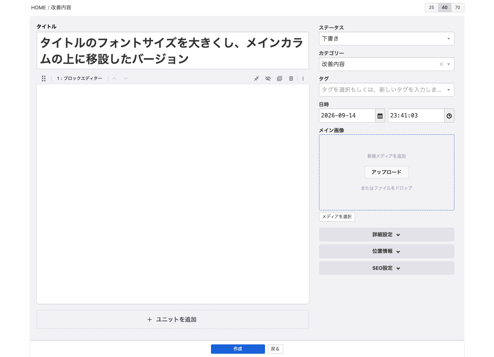

# ui33-proto

[a-blog cms](https://www.a-blogcms.jp/) の**エントリー編集画面を2カラムにする試作テーマ**。
次バージョンの管理画面UIを検討するために作ったもので、製品に入っている機能ではありません。



左に本文（ブロックエディター）、右にステータス・タイトル・カテゴリー・タグ・日時などのメタ情報を置き、
それぞれ独立してスクロールします。幅が足りなくなると自動で1カラムに戻ります。

## できること

- **2カラムレイアウト** — 本文は和文40字の行長を基準に固定、メタ情報カラムが外側に追加される
- **カラムごとの独立スクロール** — ページ自体はスクロールしない
- **カスタムフィールドの挿入位置を4か所から選べる** — `@include` を書くファイルを変えるだけで移動できる
- **パンくず** — 編集中のコンテンツがサイトのどこにあるか分かる
- **入力欄の調整** — メタ情報カラムだけ16pxに統一、ファイル名・日時・URLは等幅
- **タイトルの自動リサイズ** — 1行から始まり最大4行まで伸びる
- **位置情報の住所検索** — 使うときだけ虫眼鏡で開く

仕様と、そうした理由は [`docs/entry-edit-2column.md`](docs/entry-edit-2column.md) に全部書いてあります。
数値の根拠・実測値・踏んだ落とし穴もそこにまとめました。

## 動作環境

- a-blog cms 3.3 系
- ブラウザは **CSS コンテナクエリと `:has()` に対応したもの**（Safari 16+ / Chrome 105+ / Firefox 121+）
  - 未対応の環境では2カラムにならず、従来どおりの1カラムで表示されます（壊れません）

## 入れ方

### 1. テーマを置く

`themes/editor@beginner` を、a-blog cms の `themes/` 配下にそのままコピーします。

```
themes/editor@beginner/
```

管理ページ > コンフィグ > テーマ設定 で、テーマに **`editor@beginner`** を指定します。

### 2. Hook を入れる（任意）

ファイル名の「空にする」チェックボックスと、メイン画像の自動設定を使う場合のみ。

`extension/acms/Hook.php` の `beforePostFire()` / `saveEntry()` / `fillMainImageAfterInsert()` を、
使っている `extension/acms/Hook.php` に取り込んでください。

> ⚠️ **ファイルごと上書きしないでください。** 既存の Hook を消してしまいます。

### 3. ステータスセレクト（同梱済み）

`js/entry-status-select.js` はビルド済みのものを同梱しています。
そのままで動くので、通常はビルド不要です。

作り直す場合は [`src/entry-status-select/`](src/entry-status-select/) で `npm ci && npm run build`。

## 別のテーマに載せる

a-blog cms のテーマ継承は、ディレクトリ名の `@` でチェーンを作ります。

```
editor@beginner  →  beginner  →  system
```

**親テーマの名前がディレクトリ名に入っているので、1つの子テーマを複数の親では使い回せません。**
`site` テーマに載せるなら、ディレクトリごとコピーして名前を変えます。

```
themes/editor@beginner  →  themes/editor@site
```

3段にもできます。子ブログに独自テーマがある場合はこうなります。

```
news@editor@site  →  editor@site  →  site  →  system
```

ただし `admin/entry/field.html` と `field_side.html` などは
**親テーマのカスタムフィールド構成に合わせたもの**なので、載せ替え先に応じて見直してください。
消してしまえば親テーマのフィールド構成をそのまま使います。

## 構成

```
themes/editor@beginner/            テーマ本体
├── admin/_layouts/entry/edit.html   2カラムのレイアウト。CSS / JS もここから読み込む
├── admin/entry/                     カスタムフィールドのスロットと中身
├── css/
│   └── entry-2column.css            レイアウトと入力欄
└── js/
    ├── entry-2column.js             高さの実測、タイトルの改行抑止、位置情報の開閉
    └── entry-status-select.js       ステータス用リッチセレクト（ビルド済み）

extension/acms/Hook.php            「空にする」とメイン画像の自動設定
src/entry-status-select/           ステータスセレクトのソース
docs/entry-edit-2column.md         仕様書
```

## 設計上の約束ごと

### `custom.css` / `custom.js` という名前を使わない

テーマの継承は**チェーンの先頭が勝つ方式**で、同名ファイルはマージされません。
`include/edit/custom.css` を子テーマに置くと、親テーマの `custom.css` は一切読まれなくなります。
そのため `entry-2column.css` / `entry-2column.js` という別名にしてあります。

### CSS / JS は `admin.html` ではなくレイアウトから読み込む

子テーマに `admin.html` を置くと親の `admin.html` がまるごと置き換わり、
親の `editor-css` セクションの中身を持ち回ることになります。
代わりに、このテーマが所有している `admin/_layouts/entry/edit.html` から読み込んでいます。

### カスタムフィールドの `name` を重複させない

挿入位置は4か所あります。

| ファイル | 位置 |
|---|---|
| `field.html` | 本文カラムの上（エディターの上） |
| `field_foot.html` | 本文カラムの下（エディターの下） |
| `field_base.html` | メタ情報カラム、基本項目の下（詳細設定の上） |
| `field_side.html` | メタ情報カラムの最下部（詳細設定の下） |

**同じフィールドを複数の位置から読み込むと `input` の `name` が重複して保存が壊れます。**

また、**見つからない `@include` はエラーにならず何も出力しません。**
スロットのファイルだけ置いて中身のファイルを置き忘れると、
「スロットが効いていない」ように見えるので注意してください。

## 状態

**試作です。** 製品への採用が決まったものではなく、仕様は変わります。

検証は実機の管理画面での目視確認と、コンパイル済みCSS / JS を読み込む
ローカルの検証ページでの実測で行っています。詳細は仕様書の14章に。

## ライセンス

[MIT](LICENSE)

`admin/_layouts/entry/edit.html` は a-blog cms の `themes/system/admin/_layouts/entry/edit.html` を、
`extension/acms/Hook.php` は同梱の Hook スケルトンを、それぞれベースにしています。
